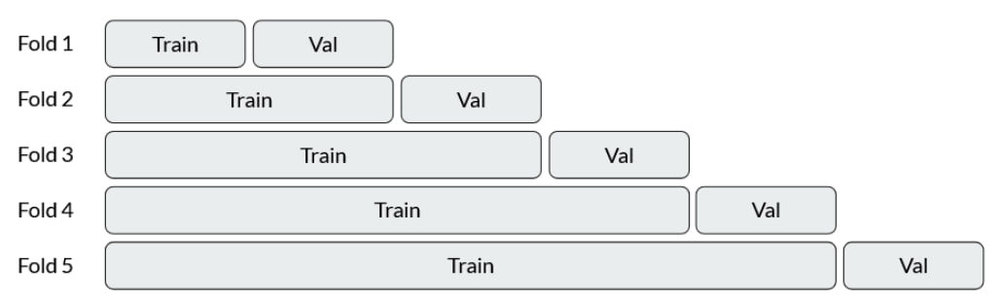

# Evaluation pipeline and baseline

**by Andrii Shevtsov**

## Base model and evaluation

All the model functionality is packed into `BaseModel` class. It has the following methods:
- `__init__`: model initialization. It takes at least target column name and a list of possible scores allowed.
- `fit`: training the model on train data in form of pandas dataframes.
- `predict`: inference of the model, primarily on evaluation dataframes.
- `__metrics`: function to calculate different metrics of the inference. They will be listed below.
- `evaluate`: function to evaluate the model. It takes whole dataframes of users, reviews and businesses. There are two types of evaluation possible with this function:
    - `full_eval`. It's a default option. It is an evaluation based on time k-fold split. The whole data (reviews) is splitted onto (k+1) equal-sized parts based on publication time. Then, the first chunk is used for training and the second for evaluation. At the second step, first two chunks are used in training and the third is used for eval and so on. Time folds count (k) is regulated by `time_folds_count` parameter with 5 as a default option.
    
    - `short_eval`. It's on when `short_eval` parameter is `True`. It is a simple train-val evaluation with time split. First `short_eval_train_samples` are taken for train-val split. Then last `short_eval_val_size` part of the dataset becomes validaion, and all before becomes training set. It is made to evaluate heavy algorithms or check that algorithm is written without errors.

### Evaluation metrics

Evaluation is complex here and consists of two parts:
- **Regression/Classification** part evaluate model's ability to evaluate businesses according to user preferences. Here, we recieve a dataframe with user scores (stars) for each restaurant and a list of model's predictions of those scores. Those predictions can be outside of [1; 5] range and the casting is perfromed before classification metrics calculations. Metrics here are:
    - RMSE;
    - MAE;
    - Accuracy;
    - Macro F1;
    - Macro precision;
    - Macro recall.
- **Ranking metrics** part evaluate model's ability to return a valid recommendations list. It is fully based on average precision metric. Metrics calculated are:
    - Average precision at 1 ("AP@1");
    - Average precision at 3 ("AP@3");
    - Average precision at K ("AP@K", where K is the number of recommendations that the model should return);
    - Mean average precision at K ("MAP").

## Median baseline

Median baseline is a very simple model. It works as follows:
- During training, it saves median stars of reviews for each restaurant.
- During evaluation, it assignes each restaurant it's stars. For new restaurants, it sets a default stars value, which is equal to the median of businesses medians. For recommendations, it always returns restaurants with the biggest median stars, but ignores those already reviewed by user.
